# 🏗️ HydroGrid - Architecture & Design Documentation

---

## 1. System Architecture Overview

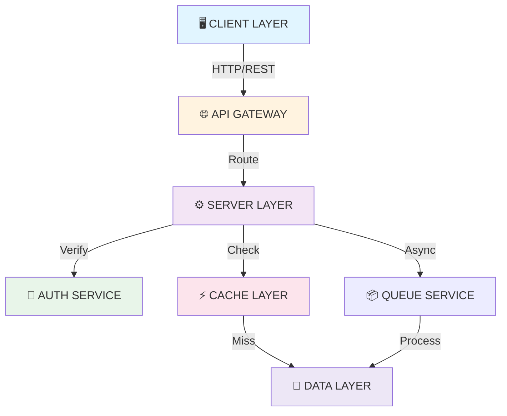

---

## 2. Frontend Architecture

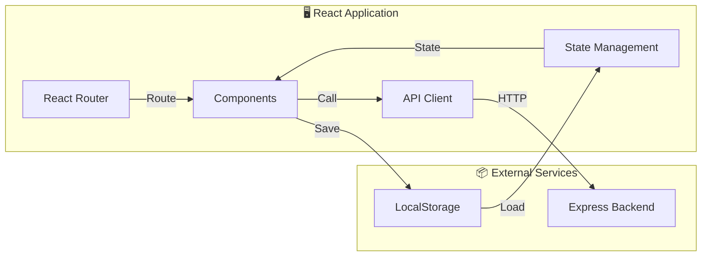

---

## 3. Backend Architecture

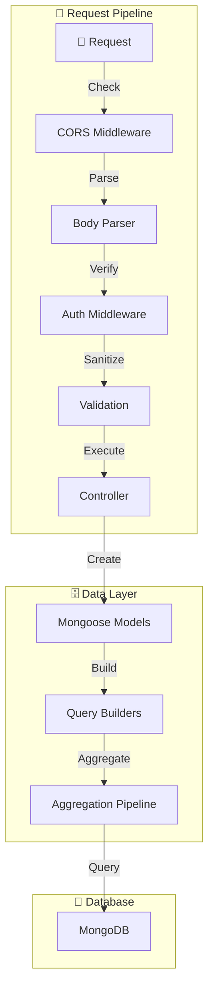

---

## 4. Authentication & Authorization Flow

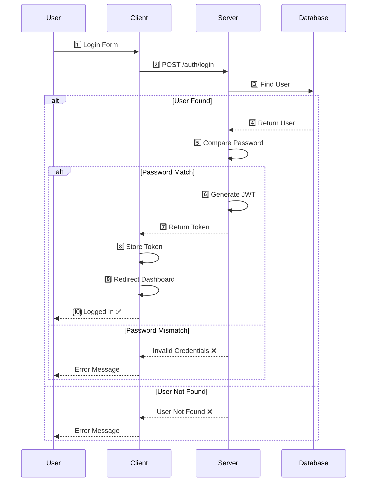

---

## 5. Admin Dashboard Data Flow

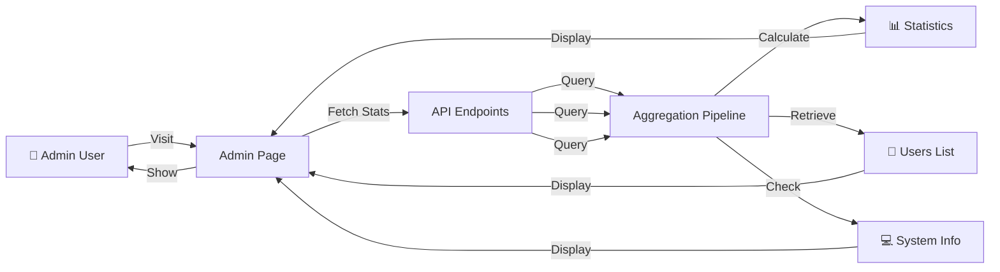

---

## 6. Database Schema Relationships

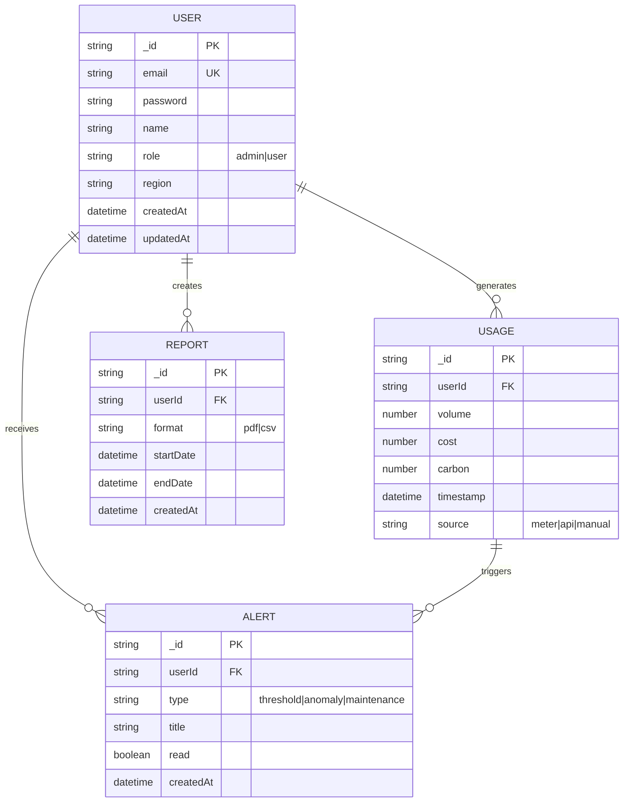

---

## 7. API Layer Architecture

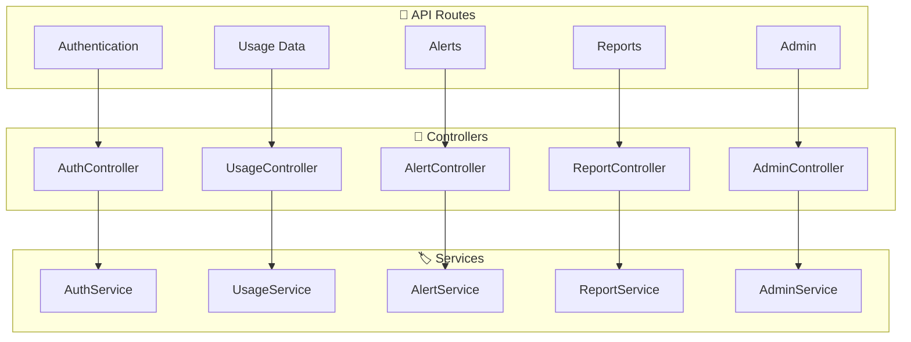

---

## 8. Component Hierarchy

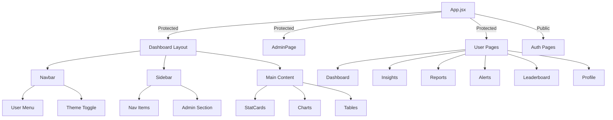

---

## 9. State Management Flow

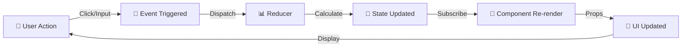

---

## 10. Error Handling Pipeline

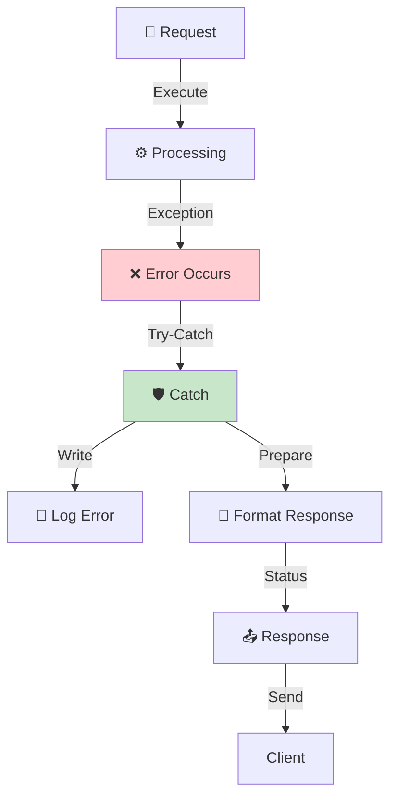

---

## 11. Real-Time Data Flow

```mermaid
graph LR
    Sensor["🌊 IoT Sensor"]
    API["📤 POST /api/usage"]
    Queue["📦 Message Queue"]
    Process["⚙️ Process"]
    Aggregate["📊 Aggregate"]
    Cache["⚡ Cache"]
    Dashboard["📈 Dashboard"]
    
    Sensor -->|Send Data| API
    API -->|Queue| Queue
    Queue -->|Consume| Process
    Process -->|Calculate| Aggregate
    Aggregate -->|Store| Cache
    Cache -->|WebSocket| Dashboard
    Dashboard -->|Realtime Update| Client["Client UI"]
```

---

## 12. Security Layers

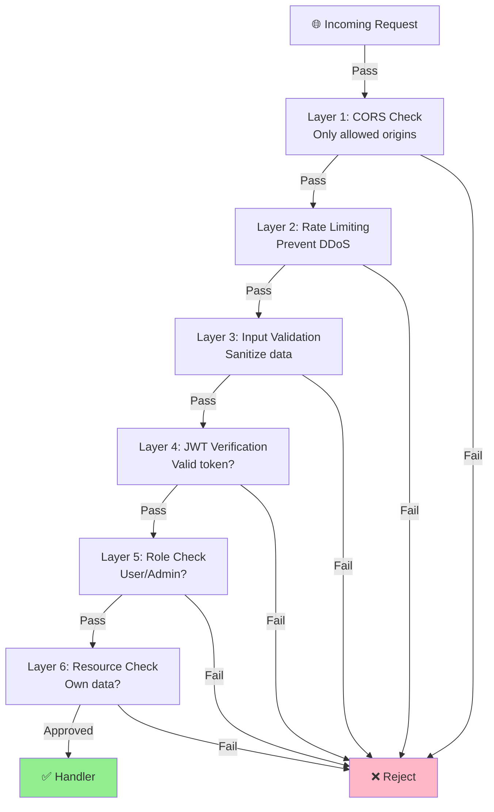

---

## 13. Deployment Pipeline

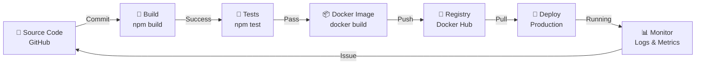

---

## 14. Performance Optimization Flow

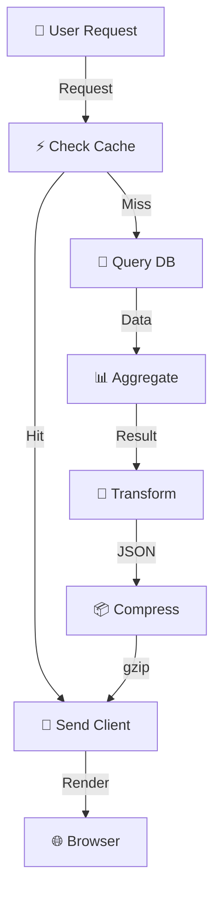

---

## 15. Testing Strategy

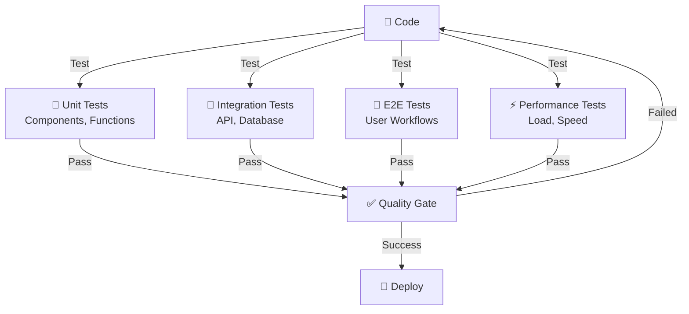

---

## 16. User Journey Map

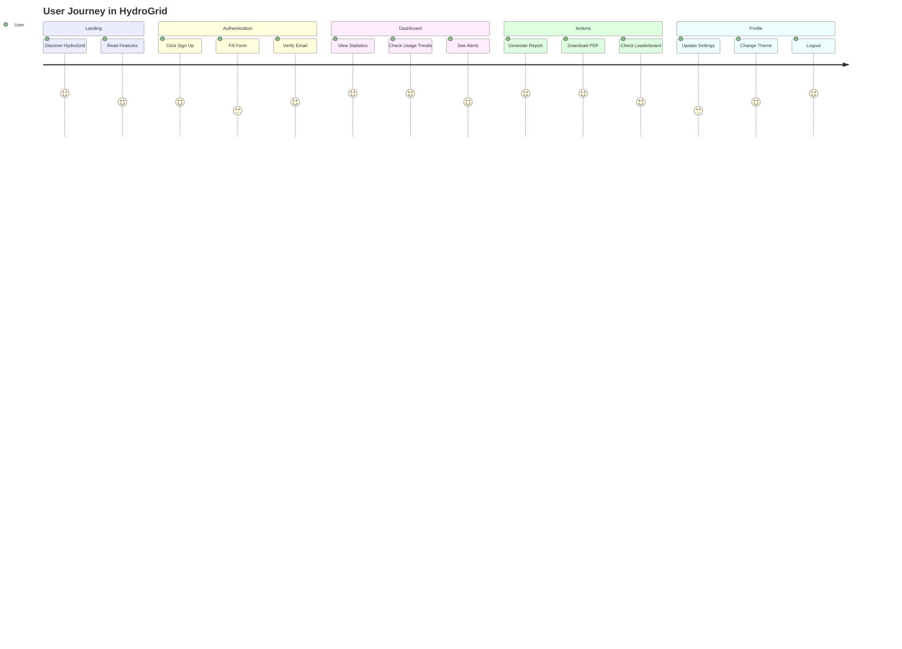

---

## 17. Development Workflow

```mermaid
graph LR
    Branch["🌳 Create Branch"]
    Dev["💻 Development"]
    Test["🧪 Local Testing"]
    Commit["📝 Commit"]
    Push["⬆️ Push"]
    PR["📥 Pull Request"]
    Review["👀 Code Review"]
    Merge["✅ Merge"]
    Deploy["🚀 Deploy"]
    
    Branch -->|feature/xyz| Dev
    Dev -->|Complete| Test
    Test -->|Pass| Commit
    Commit -->|Message| Push
    Push -->|GitHub| PR
    PR -->|Create| Review
    Review -->|Approve| Merge
    Merge -->|main| Deploy
```

---

## 18. Monitoring & Logging

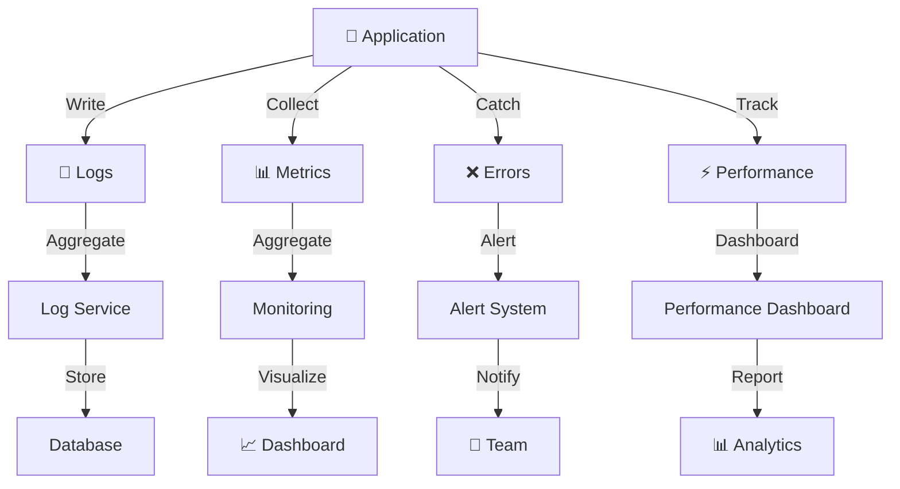

---

## Key Design Principles

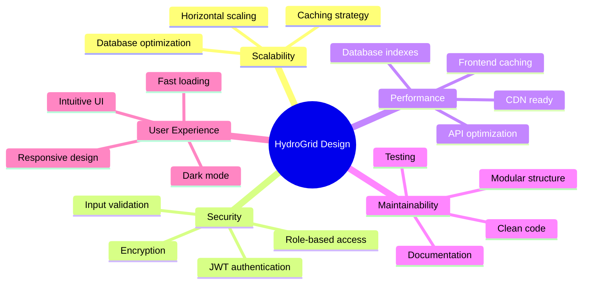

---

## Infrastructure Overview

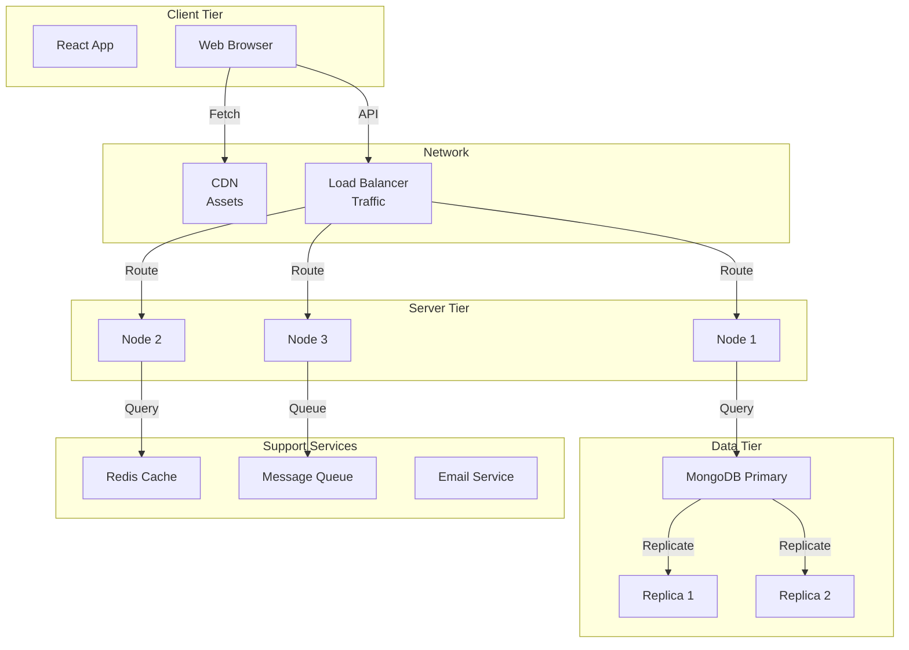

---

**Architecture Version**: 1.0.0  
**Last Updated**: April 20, 2026  
**Status**: Production Ready ✅
